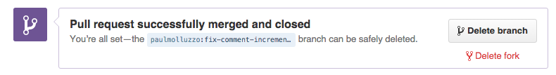

#  Refined GitHub

> Chrome extension that simplifies the GitHub interface and adds useful features

I use GitHub a lot and notice many dumb annoyances I want to fix. So here be dragons.

My hope is that GitHub will notice and implement some of these much needed improvements. So if you like any of these features, please email [GitHub support](mailto:support@github.com) about adding it.

## Highlights

- [Linkifies branch references in pull requests](https://github.com/sindresorhus/refined-github/issues/1)
- [Hides :+1: :-1: comments and shows their count in the sidebar](https://cloud.githubusercontent.com/assets/170270/13241396/0b708ae8-da1d-11e5-8c01-94eae501034c.png)
- [Adds a 'Releases' tab to repos](https://cloud.githubusercontent.com/assets/170270/13136797/16d3f0ea-d64f-11e5-8a45-d771c903038f.png) *(<kbd>g</kbd> <kbd>r</kbd> hotkey)*
- [Adds a quick edit button to the readme](https://cloud.githubusercontent.com/assets/170270/13379292/61cd4c42-de54-11e5-8829-f4b82ba8c2bc.png)
- [Adds blame links for parent commits in blame view](https://github.com/sindresorhus/refined-github/issues/2#issuecomment-189141373)
- [Adds a shortcut to quickly delete a fork repo](https://github.com/sindresorhus/refined-github/issues/48#issuecomment-191177270)
- Automagically expands the news feed when you scroll down
- Hides other users starring/forking your repos from the newsfeed
- Removes tooltips
- Removes annoying hover effect in the repo file browser
- Removes the comment box toolbar
- Moves the dashboard organization switcher to the right column

And [lots](extension/content.css) [more...](extension/content.js)

## Screenshots

### Dashboard

### Repo

### Comment box

### Shortcut to Delete Fork

## Install

Install it from the [Chrome Web Store](https://chrome.google.com/webstore/detail/refined-github/hlepfoohegkhhmjieoechaddaejaokhf) or [manually](http://superuser.com/a/247654/6877).

## Contribute

I'm happy to receive suggestions and contributions, but be aware this is a highly opinionated project. I'm not interested in adding options as it's a slippery slope into adding options for everything. Users will always disagree with something. That being said, I'm open to discussing things.

## Related

- [Tab Size on GitHub extension](https://github.com/sindresorhus/tab-size-on-github)
- [Notifier for GitHub extension](https://github.com/sindresorhus/notifier-for-github-chrome)
- [Hide Files on GitHub extension](https://github.com/sindresorhus/hide-files-on-github)
- [Show All GitHub Issues extension](https://github.com/sindresorhus/show-all-github-issues)
- [Canned Responses on GitHub extension](https://github.com/notwaldorf/github-canned-responses)

## Community tweaks

*Stuff that didn't get included, but might be useful.*

- [Quickly edit files in the repo file browser](https://github.com/devkhan/refined-github/commit/51fdf4998fc9392950e932e18018fda870f34666)

## Created by

- [Sindre Sorhus](https://sindresorhus.com)
- [Haralan Dobrev](http://hkdobrev.com)
- [Paul Molluzzo](http://paul.molluzzo.com)
- [Kees Kluskens](https://webduck.nl)
- [And our awesome contributors](https://github.com/sindresorhus/refined-github/graphs/contributors)

## License

MIT © [Sindre Sorhus](https://sindresorhus.com)
