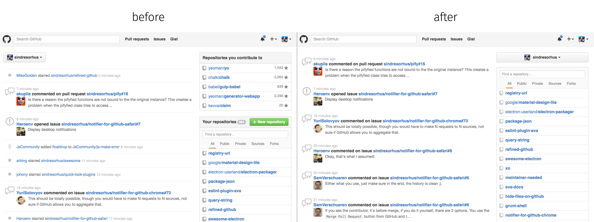
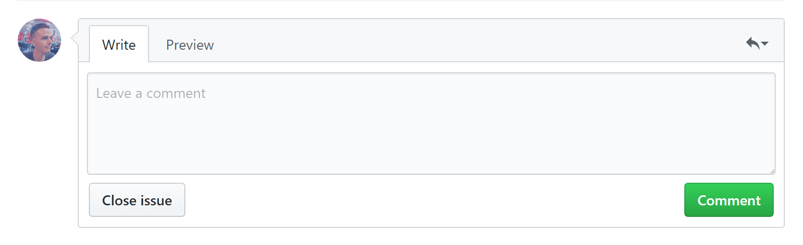

#  Refined GitHub

> Chrome extension that simplifies the GitHub interface and adds useful features

We use GitHub a lot and notice many dumb annoyances we'd like to fix. So here be dragons.

Our hope is that GitHub will notice and implement some of these much needed improvements. So if you like any of these improvements, please email [GitHub support](mailto:support@github.com) about doing it.

GitHub Enterprise is also supported by [authorizing your own domain in the options](https://github.com/sindresorhus/refined-github/pull/450). This is supported in Chrome and Firefox 55+ (to be released in August 2017).

[Read more in this blog post.](https://blog.sindresorhus.com/refined-github-21185789685d)


## Install

  + [**Chrome** extension](https://chrome.google.com/webstore/detail/refined-github/hlepfoohegkhhmjieoechaddaejaokhf)
  + [**Firefox** add-on](https://addons.mozilla.org/en-US/firefox/addon/refined-github-/)
  + Opera - Use [this Opera extension](https://addons.opera.com/en/extensions/details/download-chrome-extension-9/) to install the Chrome version.


## Highlights

- [Mark issues and pull requests as unread](https://cloud.githubusercontent.com/assets/170270/18231475/bdf83e26-72e4-11e6-958f-9ce9431d80eb.png) *(They will reappear in Notifications)*
- [Linkifies branch references in pull requests](https://github.com/sindresorhus/refined-github/issues/1)
- [Linkifies issue/PR references in issue/PR titles](https://cloud.githubusercontent.com/assets/170270/13597190/bd487ec4-e549-11e5-9521-419fa284512c.png)
- [Linkifies URLs in code](https://cloud.githubusercontent.com/assets/170270/25370217/61718820-29b3-11e7-89c5-2959eaf8cac8.png)
- [Linkifies issue references in code comments](https://cloud.githubusercontent.com/assets/170270/25370217/61718820-29b3-11e7-89c5-2959eaf8cac8.png)
- [Adds a 'Releases' tab to repos](https://cloud.githubusercontent.com/assets/170270/13136797/16d3f0ea-d64f-11e5-8a45-d771c903038f.png) *(<kbd>g</kbd> <kbd>r</kbd> hotkey)*
- [Adds a 'Compare' tab to repos](media/screenshot-compare-tab.png)
- [Adds user avatars to Reactions](media/screenshot-reactions.png)
- [Adds a quick edit button and a link to the latest release to the readme](https://cloud.githubusercontent.com/assets/4331946/25596611/4afa98ae-2eca-11e7-9dbf-72a9e7ffe82d.jpg)
- [Shows current filename in the sticky pull request header](https://cloud.githubusercontent.com/assets/170270/14153322/97a8e902-f6e1-11e5-8331-19e284e3e6fa.png)
- [Shows user's full name in comments](https://cloud.githubusercontent.com/assets/170270/16172068/0a67b98c-3580-11e6-92f0-6fc930ee17d1.png)
- [Improves readability of tab indented code](https://cloud.githubusercontent.com/assets/170270/14170088/d3be931e-f755-11e5-8edf-c5f864336382.png)
- [Adds a 'Copy' button to the file view](https://cloud.githubusercontent.com/assets/170270/14453865/8abeaefe-00c1-11e6-8718-9406cee1dc0d.png)
- [Adds a shortcut to quickly delete a forked repo](https://cloud.githubusercontent.com/assets/170270/13520281/b2c9335c-e211-11e5-9e36-b0f325166356.png)
- [Adds option to view diffs without whitespace changes](https://cloud.githubusercontent.com/assets/170270/17603894/7b71a166-6013-11e6-81b8-22950ab8bce3.png) *(<kbd>d</kbd> <kbd>w</kbd> hotkey)*
- [Adds links to patch and diff for each commit](https://cloud.githubusercontent.com/assets/737065/13605562/22faa79e-e516-11e5-80db-2da6aa7965ac.png)
- [Differentiates merge commits from regular commits](https://cloud.githubusercontent.com/assets/170270/14101222/2fe2c24a-f5bd-11e5-8b1f-4e589917d4c4.png)
- [Adds `Copy` button to gist files](https://cloud.githubusercontent.com/assets/170270/21074840/5dc37578-bf03-11e6-9fd9-501d73edef87.png)
- [Adds `Copy` button for file paths to pull request diffs](https://cloud.githubusercontent.com/assets/4201088/26023064/18c9c77c-37d2-11e7-8926-b0a05a2706ae.png)
- [Adds labels to comments by the original poster](https://cloud.githubusercontent.com/assets/4331946/25075520/d62fbbd0-2316-11e7-921f-ab736dc3522e.png)
- [Adds navigation to milestone pages](https://cloud.githubusercontent.com/assets/170270/25217211/37b67aea-25d0-11e7-8482-bead2b04ee74.png)
- [Adds search filter for 'Everything commented by you'](https://cloud.githubusercontent.com/assets/940070/25518367/cb917d3e-2c36-11e7-8475-c4e6dbe0ed6c.png)
- [Moves destructive buttons ("Close issue", "Cancel") in commenting forms away from primary button](#comment-box)
- [Adds `Yours` button to Issues/Pull Requests page](https://cloud.githubusercontent.com/assets/1282980/14636384/0d8770e4-0623-11e6-8520-2054bece2771.png)
- [Condenses long URLs into references like _user/repo/.file@`d71718d`_](https://user-images.githubusercontent.com/1402241/27252232-8fdf8ed0-538b-11e7-8f19-12d317c9cd32.png)
- Easier copy-pasting from diffs by making +/- signs unselectable
- Shows the reactions popover on hover instead of click
- Supports indenting with the tab key in textareas like the comment box (<kbd>Shift</kbd> <kbd>Tab</kbd> for original behavior)
- Automagically expands the news feed when you scroll down
- Hides other users starring/forking your repos from the newsfeed ([optional](https://user-images.githubusercontent.com/1402241/27267240-9d2e18c8-54d9-11e7-8a64-971af9e066f3.png))
- Prompts you when pressing `Cancel` on an inline comment in case it was a mistake
- Moves the dashboard organization switcher to the right column
- Adds a `Trending` link to the global navbar. *(<kbd>g</kbd> <kbd>t</kbd> hotkey)*
- Removes annoying hover effect in the repo file browser
- Removes the comment box toolbar
- Removes tooltips
- Removes the "Projects" repo tab when there are no projects
- Copy canonical link to file when [the `y` hotkey](https://help.github.com/articles/getting-permanent-links-to-files/) is used
- [Uses the pull request title as commit title when merging with 'Squash and merge'](https://github.com/sindresorhus/refined-github/issues/276)
- ~~[Adds blame links for parent commits in blame view](https://github.com/sindresorhus/refined-github/issues/2#issuecomment-189141373)~~ [Implemented by GitHub](https://github.com/blog/2304-navigate-file-history-faster-with-improved-blame-view)
- ~~[Adds ability to collapse/expand files in a pull request diff](https://cloud.githubusercontent.com/assets/170270/13954167/40caa604-f072-11e5-89ba-3145217c4e28.png)~~ [Implemented by GitHub](https://cloud.githubusercontent.com/assets/170270/25772137/6a6b678e-3296-11e7-97c7-02e31ef17743.png)

And [lots](extension/content.css) [more...](extension/content.js)


## Screenshots

### Dashboard



### Repo


### Reactions


### Comment box



### Linkified URLs and issue references in code


### Community tweaks

*Stuff that didn't get included, but might be useful.*

- [Quickly edit files in the repo file browser](https://github.com/devkhan/refined-github/commit/51fdf4998fc9392950e932e18018fda870f34666)


## Contribute

We're happy to receive suggestions and contributions, but be aware this is a highly opinionated project. There's [a single commonly-requested option](https://user-images.githubusercontent.com/1402241/27267240-9d2e18c8-54d9-11e7-8a64-971af9e066f3.png) but we're not interested in adding more as it's a slippery slope into adding one for everything. Users will always disagree with something. That being said, we're open to discussing things.


## Customization

While this project is highly opinionated, this doesn't necessarily limit you from manually disabling functionality that is not useful for your workflow. Options include:

1. *(CSS Only)* Use a Chrome extension that allows injecting custom styles into sites, based on a URL pattern. [Stylist](https://chrome.google.com/webstore/detail/stylish/fjnbnpbmkenffdnngjfgmeleoegfcffe?hl=en) is one such tool. [Example](https://github.com/sindresorhus/refined-github/issues/136#issuecomment-204072018)

2. Clone the repository, make the adjustments you need, and [load the unpacked extension in Chrome](https://developer.chrome.com/extensions/getstarted#unpacked), rather than installing from the Chrome Store.


## Development

To run it locally, you'll need to build it with:

```sh
# Build once
npm run build
```

```sh
# Build every time a file changes
npm run watch
```

Once built, load it in the browser.

### Chrome

1. Visit `chrome://extensions/` in Chrome
2. Enable the **Developer mode**
3. Click on **Load unpacked extension**
4. Select the folder `extension`

### Firefox

1. Visit `about:debugging#addons` in Firefox
2. Click on **Load Temporary Add-on**
3. Select the file `extension/manifest.json`


## Related

- [Refined Wikipedia](https://github.com/ismamz/refined-wikipedia) - Like this, but for Wikipedia
- [Notifier for GitHub](https://github.com/sindresorhus/notifier-for-github-chrome) - Shows your notification unread count
- [Hide Files on GitHub](https://github.com/sindresorhus/hide-files-on-github) - Hides dotfiles from the file browser
- [Show All GitHub Issues](https://github.com/sindresorhus/show-all-github-issues) - Shows both Issues and Pull Requests in the Issues tab
- [Contributors on GitHub](https://github.com/hzoo/contributors-on-github) - Shows stats about contributors
- [Twitter for GitHub](https://github.com/bevacqua/twitter-for-github) - Shows a user's Twitter handle on their profile page
- [GifHub](https://github.com/DrewML/GifHub) - Quickly insert GIFs in comments
- [Octo Linker](https://github.com/octo-linker/chrome-extension/) - Navigate across files and packages
- [Awesome browser extensions for GitHub](https://github.com/stefanbuck/awesome-browser-extensions-for-github) - Awesome list
- [OctoEdit](https://github.com/DrewML/OctoEdit) - Markdown syntax highlighting in comments
- [GitHub Clean Feed](https://github.com/bfred-it/github-clean-feed) - Group news feed events by repo


## Created by

- [Sindre Sorhus](https://github.com/sindresorhus)
- [Haralan Dobrev](https://github.com/hkdobrev)
- [Paul Molluzzo](https://github.com/paulmolluzzo)
- [Andrew Levine](https://github.com/DrewML)
- [Kees Kluskens](https://github.com/SpaceK33z)
- [Jonas Gierer](https://github.com/jgierer12)
- [Federico Brigante](https://github.com/bfred-it)
- [Contributors…](https://github.com/sindresorhus/refined-github/graphs/contributors)


## License

MIT
