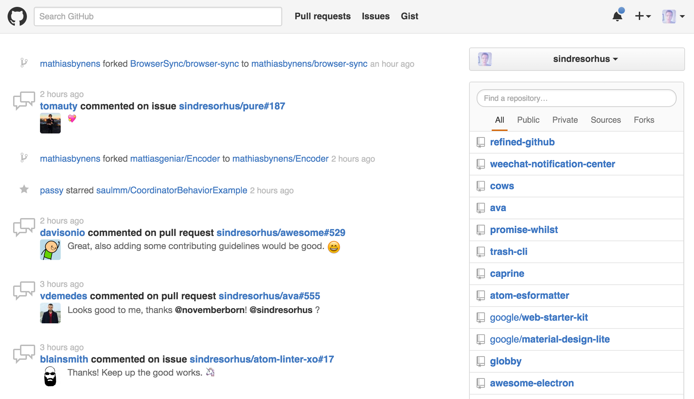
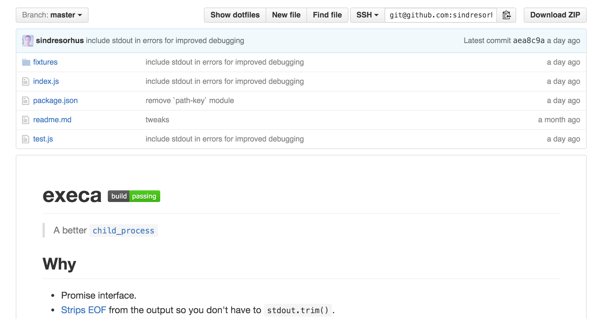
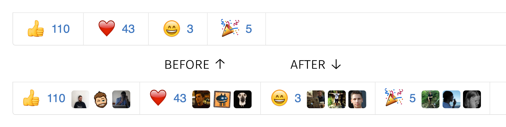

#  Refined GitHub

> Chrome extension that simplifies the GitHub interface and adds useful features

We use GitHub a lot and notice many dumb annoyances we'd like to fix. So here be dragons.

Our hope is that GitHub will notice and implement some of these much needed improvements. So if you like any of these improvements, please email [GitHub support](mailto:support@github.com) about doing it.

## Highlights

- [Linkifies branch references in pull requests](https://github.com/sindresorhus/refined-github/issues/1)
- [Linkifies issue/PR references in issue/PR titles](https://cloud.githubusercontent.com/assets/170270/13597190/bd487ec4-e549-11e5-9521-419fa284512c.png)
- [Adds a 'Releases' tab to repos](https://cloud.githubusercontent.com/assets/170270/13136797/16d3f0ea-d64f-11e5-8a45-d771c903038f.png) *(<kbd>g</kbd> <kbd>r</kbd> hotkey)*
- [Adds user avatars to Reactions](screenshot-reactions.png)
- [Adds a quick edit button to the readme](https://cloud.githubusercontent.com/assets/170270/13379292/61cd4c42-de54-11e5-8829-f4b82ba8c2bc.png)
- [Shows current filename in the sticky pull request header](https://cloud.githubusercontent.com/assets/170270/14153322/97a8e902-f6e1-11e5-8331-19e284e3e6fa.png)
- [Adds blame links for parent commits in blame view](https://github.com/sindresorhus/refined-github/issues/2#issuecomment-189141373)
- [Improves readability of tab indented code](https://cloud.githubusercontent.com/assets/170270/14170088/d3be931e-f755-11e5-8edf-c5f864336382.png)
- [Adds a 'Copy' button to the file view](https://cloud.githubusercontent.com/assets/170270/14453865/8abeaefe-00c1-11e6-8718-9406cee1dc0d.png)
- [Adds a shortcut to quickly delete a forked repo](https://cloud.githubusercontent.com/assets/170270/13520281/b2c9335c-e211-11e5-9e36-b0f325166356.png)
- [Adds ability to collapse/expand files in a pull request diff](https://cloud.githubusercontent.com/assets/170270/13954167/40caa604-f072-11e5-89ba-3145217c4e28.png)
- [Adds links to patch and diff for each commit](https://cloud.githubusercontent.com/assets/737065/13605562/22faa79e-e516-11e5-80db-2da6aa7965ac.png)
- [Differentiates merge commits from regular commits](https://cloud.githubusercontent.com/assets/170270/14101222/2fe2c24a-f5bd-11e5-8b1f-4e589917d4c4.png)
- Shows the reactions popover on hover instead of click
- Supports indenting with the tab key in textareas like the comment box (<kbd>Shift</kbd> <kbd>Tab</kbd> for original behavior)
- Automagically expands the news feed when you scroll down
- Hides other users starring/forking your repos from the newsfeed
- Prompts you when pressing `Cancel` on an inline comment in case it was a mistake
- Moves the dashboard organization switcher to the right column
- Removes annoying hover effect in the repo file browser
- Removes the comment box toolbar
- Removes tooltips

And [lots](extension/content.css) [more...](extension/content.js)

## Screenshots

### Dashboard

### Repo

### Reactions

### Comment box

## Install

Install it from the [Chrome Web Store](https://chrome.google.com/webstore/detail/refined-github/hlepfoohegkhhmjieoechaddaejaokhf) or [manually](http://superuser.com/a/247654/6877).

## Contribute

We're happy to receive suggestions and contributions, but be aware this is a highly opinionated project. We're not interested in adding options as it's a slippery slope into adding it for everything. Users will always disagree with something. That being said, we're open to discussing things.

## Related

- [**Safari version**](https://github.com/fantattitude/refined-github-safari)
- [Refined Twitter](https://github.com/sindresorhus/refined-twitter) - Like this, but for Twitter
- [Notifier for GitHub](https://github.com/sindresorhus/notifier-for-github-chrome) - Shows your notification unread count
- [Hide Files on GitHub](https://github.com/sindresorhus/hide-files-on-github) - Hides dotfiles from the file browser
- [Show All GitHub Issues](https://github.com/sindresorhus/show-all-github-issues) - Shows both Issues and Pull Requests in the Issues tab
- [Contributors on GitHub](https://github.com/hzoo/contributors-on-github) - Shows stats about contributors
- [Twitter for GitHub](https://github.com/bevacqua/twitter-for-github) - Shows a user's Twitter handle on their profile page
- [GifHub](https://github.com/DrewML/GifHub) - Quickly insert GIFs in comments
- [Octo Linker](https://github.com/octo-linker/chrome-extension/) - Navigate across files and packages
- [Awesome browser extensions for GitHub](https://github.com/stefanbuck/awesome-browser-extensions-for-github) - Awesome list
- [GitHub +1](https://github.com/ryanflorence/github-plusone-extension) - Shows total count of +1 comments and hides them

## Community tweaks

*Stuff that didn't get included, but might be useful.*

- [Quickly edit files in the repo file browser](https://github.com/devkhan/refined-github/commit/51fdf4998fc9392950e932e18018fda870f34666)

## Customization

While this project is highly opinionated, this doesn't necessarily limit you from manually disabling functionality that is not useful for your workflow. Options include:

1. *(CSS Only)* Use a Chrome extension that allows injecting custom styles into sites, based on a URL pattern. [Stylist](https://chrome.google.com/webstore/detail/stylish/fjnbnpbmkenffdnngjfgmeleoegfcffe?hl=en) is one such tool. [Example](https://github.com/sindresorhus/refined-github/issues/136#issuecomment-204072018)

2. Clone the repository, make the adjustments you need, and [load the unpacked extension in Chrome](https://developer.chrome.com/extensions/getstarted#unpacked), rather than installing from the Chrome Store.

## Created by

- [Sindre Sorhus](https://sindresorhus.com)
- [Haralan Dobrev](http://hkdobrev.com)
- [Paul Molluzzo](http://paul.molluzzo.com)
- [Andrew Levine](https://github.com/DrewML)
- [Kees Kluskens](https://webduck.nl)

[And our awesome contributors](https://github.com/sindresorhus/refined-github/graphs/contributors)

## License

MIT © [Sindre Sorhus](https://sindresorhus.com)
